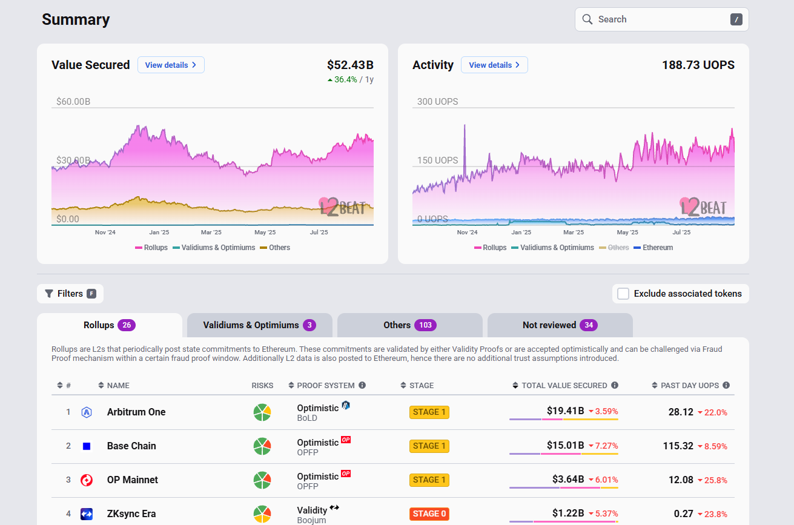

# 1. 소개 (Introduction)

- L2(레이어 2) 체인의 성숙ㄷ고는 특정 속성에 따라 평가되며, 단계(Stage)로 구분됨.

- L2Beat (L2B) 팀은 L2 체인이 점점 더 탈중앙화로 나아가도록 권장하기 위해 이런 분류 체계를 제공함  

# 2. 롤업 단계 (Rollup Stages)
 

## Stage 0

- 거버넌스(운영): 주로 운영자(Operator)와 보안 위원회(security council)가 결정.

- 투명성: 오픈소스 소프트웨어를 통해 L1 데이터로부터 L2 상태를 재구성 가능함

- Exit: 사용자가 롤업에서 나갈 수 있음(7일 소요). 하지만 운영자의 개입이 필요함
 

## Stage 1

- 거버넌스: 점점 스마트 컨트랙트 기반으로 운영. 보안 위원회는 버그 수정 같은 특별 상황에서만 개입.

- 검증 시스템: 완전 가동 -> 유효성 증명(validity proofs)을 분산적으로 제출 가능.

- Exit: 사용자가 운영자 도움 없이 독립적으로 탈출 가능. 

## Stage 2

- 거버넌스: 완전히 스마트 컨트랙트로 운영 -> 운영자/위원회의 개입 필요 없음.

- 검증 시스템: 퍼미션리스(permissionless), 누구나 증명 제출 가능.

- Exit: 완전히 탈중앙화된 탈출 메커니즘.

- 보안 위원회 역할: 온체인 오류가 발생했을 때 예외적으로 개입하는 수준.  

# 3. ZKSync 리스크 분석

현재 ZKSync Era는 아직 Stage 0 상태. L2Beat 페이지에서 리스크 분석을 확인할 수 있음. 

## 데이터 가용성 (Data Availability)

- L1 데이터로부터 L2 상태를 재구성할 수 있는 능력.

- -> 누구나 필요할 경우 L2 상태를 검증 및 복구 가능. 

## 상태 검증 (State Validation)

- 번들된 트랜잭션이 적당한지 검증하는 과정.

- ZKSync는 PLONK를 사용해 검증 수행.

## 시퀸서 장애 (Sequencer Failure)

- 시퀀서가 다운되더라도 사용자는 여전히 L1에 트랜잭션 제출 가능.

- 다만 즉시 반영이 보장되는 것은 아님. 

## 프로포저 장애 (Proposer Failure)

- 프로포저가 다운되면 모든 출금 및 거래 실행이 중단됨. 

## Exit 윈도우

- 현재 ZKSync 단계에서는 원치 않는 업그레이드가 있을 때 탈출할 수 있는 기간이 없음
(no exit window)  

# ZKsync Era를 쓰는 이유

1. 보안: 이더리움과 동일한 보안성 상속 -> 검증된 거래만 처리.

2. EVM 호환: Solidty로 작성한 스마트컨트랙트를 거의 그대로 배포 가능.

3. 지갑 지원: 기존 이더리움 지갑(MetaMask 등) 그대로 사용, 주소 동일.

4. 저비용 & 확장성: 트랜잭션 번들링으로 가스비 절감 + 사용자 증가에도 효율적임.

결론적으로 보안, 호환성, 비용 절감, 편의성 때문에 스마트컨트랙트 배포에 최적함.

