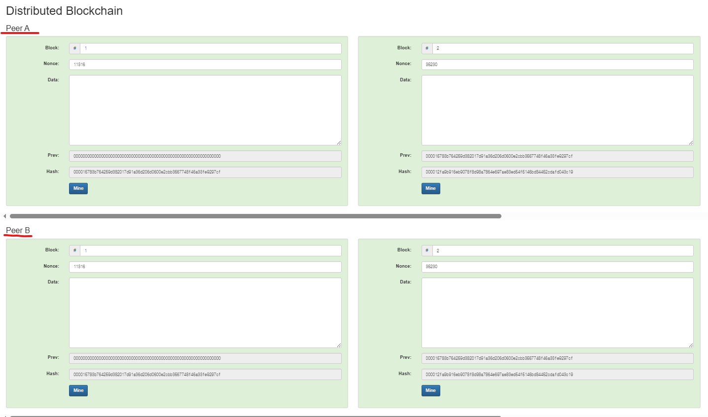

# 1. 해시 함수(Hash)

- 해쉬는 임이의 데이터를 고정 길이의 문자여롤 바꿔 주는 함수 입력이 **조금이라도 바뀌면** 결과가 완전히 달라짐

- 이더리움은 keccak256
SHA-256과는 다른 해시 함수지만, 핵심 개념(고정 길이, 충돌에 강함, 입력 민감함)은 같음

- 앱에서 "data"에 무엇을 넣든, 그 데이터는 해시 알고리즘을 거쳐 고유한 해시가 만들어진다. 입력이 길어져도 **해시 길이는 항상 같음.**  

# 2. 블록과 채굴(Mining)

- 블록은 보통 블록 번호, nonce, data로 구성되고, 이 세 값 전체를 해시해 블록 해시를 만듦.

- 채굴은 "해시가 0000으로 시작" 같은 난이도 조건을 만족하도록 nonce를 계속 바꿔가며 맞추는 시도 브루트포스 과정.

- 고로 데이터가 한 글자라도 바뀌면 해쉬가 바뀌어서 블록이 무효가 된다. 그래서 다시 채굴해야 함  

# 3. 불변성(Immuatbility)

- 각 블록은 자기 내용(번호/nonce/data) + 이전 블록의 해시를 포함

- 그래서 중간 블록 하나라도 바뀌면 그 이후 모든 블록이 줄줄이 무효가 됨 전부 다시 채굴해야 함.

- 첫 번째 블록을 제네시스 블록이라 함  

# 4. 분산(Decentralization)

- 한 주체가 체인을 혼자 관리하면, 마음대로 바꾸고 다시 채굴할 수 있어서 위험함

- 실제 블록체인은 **여러 노드**가 같은 프로토콜을 돌림. 서로 다른 체인 상태가 생기면, **가장 작업량 큰 체인**이 정답으로 채택됨.

- 다수와 합의하지 못하면 **포크**가 나서 다른 곳으로 진행함  

# 5. 블록과 트랜잭션

- 실제 블록의 data는 그냥 문자열이 아니라 **여러 트랜잭션 묶음**이다. 이 트랜잭션들과 함께 해시해 블록에 넣음

- 트랜잭션 하나라도 수정하면 블록 해시가 바뀌고, 결과적으로 체인 전체가 무효가 됨

